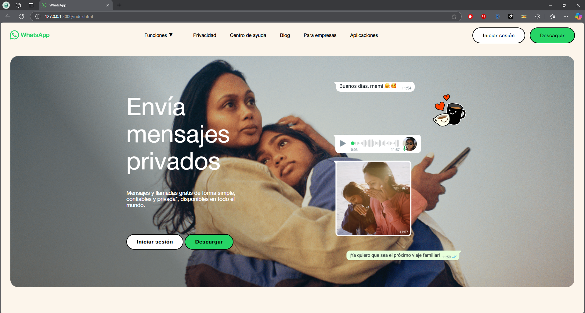
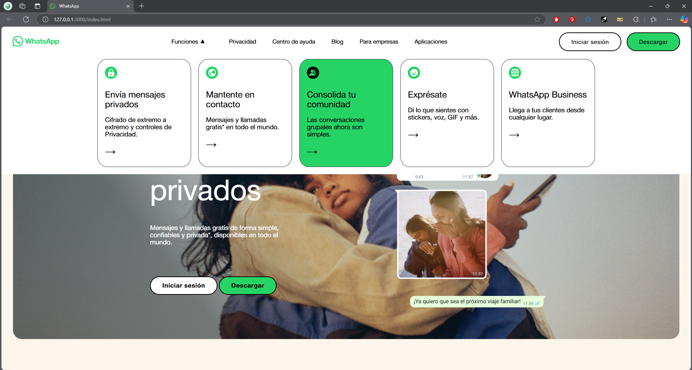

# ChatAppTemplate

## GitHub Pages: https://yuleiditho.github.io/ChatAppTemplate/#

## Descripción: 
Este repositorio contiene una plantilla de la interfaz de WhatsApp. 

## Entrega:
- Lección 5 : Alineación con Flexbox 

